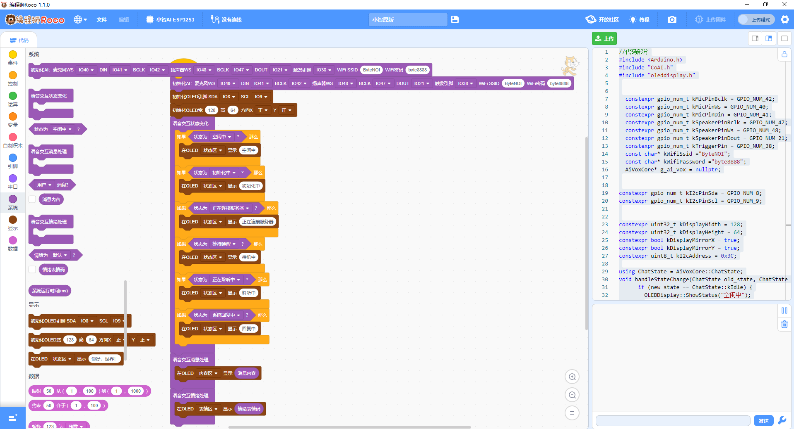
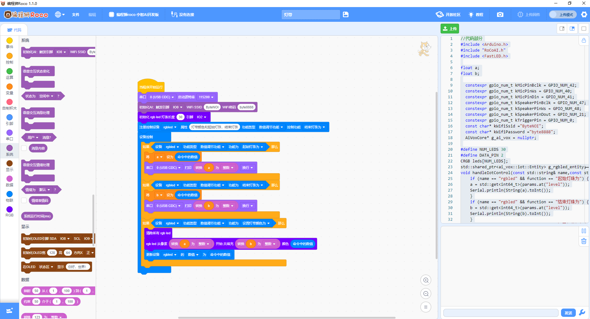

# 小智AI图形化编程工具

一款支持小智AI聊天机器人的图形化编程软件，让AI开发更简单直观。

## 下载安装

[前往发行版页面下载最新版本](https://github.com/zkfangkuai/xiaozhi-scratch/releases)

## 功能特点

- 🖱️ 拖拽式图形化编程界面
- 🤖 集成小智AI聊天机器人功能
- 🔌 支持本地物联控制其他设备
- 🎤 其它扩展

## 界面预览

|  |  |  |

## 使用说明

1. 从发行版下载并安装本软件
2. 通过图形化界面拖拽编程块
3. 连接小智AI设备
4. 运行并测试你的AI程序

## 微信

## 鸣谢

- [xiaozhi-esp32](https://github.com/78/xiaozhi-esp32)
- [OpenBlock](https://github.com/openblockcc/openblock-desktop)
- [AI VOX](https://github.com/nulllaborg/ai_vox)
